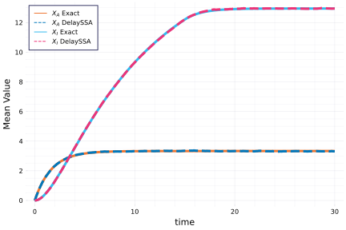

# A birth-death example with delay degradation

## Model

The model is defined as follows: 1. $C:\emptyset \rightarrow X_A$; 2. $\gamma : X_A \rightarrow \emptyset$; 3. $\beta : X_A \rightarrow  X_I$, which triggers $X_I\Rightarrow \emptyset$ after $\tau$ time; 4. $\gamma: X_I \rightarrow \emptyset$, which causes the delay channel to change its state during a schduled delay reaction.

This example is studied by Lafuerza and Toral in [1], where one can solve the solution analytically. If we denote $\langle X_A\rangle(t)$ to be the mean value of $X_A$ at time $t$, and $\langle X_I\rangle(t)$ the mean value of $X_I$ at time $t$, then
```math
\langle X_A\rangle(t)= \frac{C}{a}( 1-e^{-at} ),\quad \langle X_I\rangle(t) = \begin{cases}
\frac{C\beta}{a-γ}\big[\frac{1-e^{-γt}}{γ}-\frac{1-e^{-at}}{a}\big]，& t \in [0,\tau]\\
\frac{C\beta}{a}\Big[\frac{1-e^{-γτ}}{γ}+\frac{(1-e^{\tau(a-γ)})}{a-γ}e^{-at}\Big], & t \in (\tau,\infty)
\end{cases}
```
where $a = β + γ$.

We first define the parameters and the mass-action jump (see [Defining a Mass Action Jump](https://diffeq.sciml.ai/stable/types/jump_types/#Defining-a-Mass-Action-Jump) for details)
## Markovian part
```julia
C, γ, β, τ = [2., 0.1, 0.5, 15.]
rate1 = [C,γ,β,γ]
reactant_stoich = [[],[1=>1],[1=>1],[2=>1]]
net_stoich = [[1=>1],[1=>-1],[1=>-1,2=>1],[2=>-1]]
mass_jump = MassActionJump(rate1, reactant_stoich, net_stoich; scale_rates =false)
jumpset = JumpSet((),(),nothing,[mass_jump])
```
We refer to [this example](tutorials.md) for more details about the constuction of a `Jumpset`.

Then we initialise the problem by setting
```julia
u0 = [0, 0]
tf = 30.
saveat = .1
de_chan0 = [[]]
tspan = (0.,tf)
```
where `de_chan0` is the initial condition for the delay channel, which is a vector of arrays whose `k`th entry stores the schduled delay time for `k`th delay channel. Here we assume $X_I(0) = 0$, thus only an empty array. So we can define the `DiscreteProblem`
```julia
dprob = DiscreteProblem(u0, tspan)
```

## Non-Markovian part

Then we turn to the definition of delay reactions

```julia
delay_trigger_affect! = function (integrator, rng)
   append!(integrator.de_chan[1], τ)
end
delay_trigger = Dict(3=>delay_trigger_affect!)
delay_complete = Dict(1=>[2=>-1]) 

delay_affect! = function (de_chan, rng)
    i = rand(rng, 1:length(de_chan[1]))
    deleteat!(de_chan[1],i)
end
delay_interrupt = Dict(4=>delay_affect!) 
delayjumpset = DelayJumpSet(delay_trigger,delay_complete,delay_interrupt)
```

- `delay_trigger`  
  - Keys: Indices of reactions defined in `jumpset` that can trigger the delay reaction. Here we have the 3rd reaction $\beta: X_A \rightarrow X_I$ that will trigger the degradation of $X_I$ after time $\tau$.
  - Values: A update function that determines how to update the delay channel. In this example, once the delay reaction is triggered, the first delay channel (which is the channel for $X_I$) will be added to a delay time $\tau$.			
- `delay_interrupt`
  - Keys: Indices of reactions defined in `jumpset` that can cause the change in delay channel. In this example, the 4th reaction $\gamma : X_I \rightarrow \emptyset$ will change the schduled delay reaction to change its state immediately.
  - Values: A update function that determines how to update the delay channel. In this example, once a `delay_interrupt` reaction happens, one (randomly picked) of the reactants $X_I$ that is supposed to leave the system after time $\tau$ is degraded immediately.  
- `delay_complete` 
  - Keys: Indices of delay channels. Here the first delay channel corresponds to $X_I$.
  - Values: A vector of `Pair`s, mapping species id to net change of stoichiometric coefficient.

Next, we choose a delay SSA algorithm and define the problem
```julia
djprob = DelayJumpProblem(dprob, DelayRejection(), jumpset, delayjumpset, de_chan0, save_positions=(true,true))
```
where `DelayJumpProblem` inputs `JumpProblem`, `DelayJumpSet` and the initial condition of the delay channel `de_chan0`.

## Visualisation
Now we can solve the problem and plot a trajectory
```julia
sol = solve(djprob, SSAStepper(), seed=2, saveat =.1, save_delay_channel = false)
```

Then we simulate $10^4$ trajectories and calculate the evolution of the mean value for each reactant
```julia
using DiffEqBase
ens_prob = EnsembleProblem(djprob)
ens =@time solve(ens_prob,SSAStepper(),EnsembleThreads(),trajectories = 1e4, saveat = .1, save_delay_channel =false)
```


### Verification with the exact solution
We compare with the mean values of the exact solutions $X_I, X_A$
```julia
timestamps = 0:0.1:tf
a = β + γ 
mean_x_A(t) = C/a*(1-exp(-a*t))
mean_x_I(t)= 0<=t<=τ ? C*β/(a-γ)*((1-exp(-γ*t))/γ - (1-exp(-a*t))/a) : C*β/a*((1-exp(-γ*τ))/γ + exp(-a*t)*(1-exp((a-γ)τ))/(a-γ))
```



# A multiple delay reactions example

We can also extend the model to multiple delay reactions, i.e. mutiple delay channels having simultaneous delay reactions.

The model is defined as follows: 1. $C:\emptyset \rightarrow X_A$; 2. $\gamma : X_A \rightarrow \emptyset$; 3. $\beta : X_A \rightarrow X_{I1}+X_{I2}$, which triggers $X_{I1},X_{I2}\rightarrow \emptyset$ after $\tau$ time; 4. $\gamma : X_{I1} \rightarrow \emptyset$; 5. $\gamma : X_{I2} \rightarrow \emptyset$. The 4th and 5th reactions will cause the delay channel to change its state during a schduled delay reaction.

Similarly, we define the problem as follows:
## Markovian part
```julia
C, γ, β, τ = [2., 0.1, 0.5, 15.]
rate1 = [C,γ,β,γ,γ]
reactant_stoch = [[],[1=>1],[1=>1],[2=>1],[3=>1]]
net_stoch = [[1=>1],[1=>-1],[1=>-1,2=>1,3=>1],[2=>-1],[3=>-1]]
mass_jump = MassActionJump(rate1, reactant_stoch, net_stoch; scale_rates =false)
jumpset = JumpSet((),(),nothing,[mass_jump])
```

```julia
u0 = [0, 0, 0]
tf = 30.
saveat = .1
de_chan0 = [[]]
tspan = (0.,tf)
dprob = DiscreteProblem(u0, tspan)
```
## Non-Markovian part
```julia
delay_trigger_affect! = function (de_chan, rng)
   append!(de_chan[1], τ)
   append!(de_chan[2], τ)
end
delay_trigger = Dict(3=>delay_trigger_affect!)
delay_complete = Dict(1=>[2=>-1],2=>[3=>-1]) 

delay_affect1! = function (de_chan, rng)
    i = rand(rng, 1:length(de_chan[1]))
    deleteat!(de_chan[1],i)
end
delay_affect2! = function (de_chan, rng)
    i = rand(rng, 1:length(de_chan[2]))
    deleteat!(de_chan[2],i)
end
delay_interrupt = Dict(4=>delay_affect1!,5=>delay_affect2!) 
delayjumpset = DelayJumpSet(delay_trigger,delay_complete,delay_interrupt)
```

```julia
djprob = DelayJumpProblem(dprob, DelayRejection(), jumpset, delayjumpset, de_chan0, save_positions=(true,true))
```
## Visualisation
```julia
sol =@time solve(djprob, SSAStepper(),seed=10, saveat =.1, save_delay_channel = false)
ens_prob = EnsembleProblem(djprob)
ens =@time solve(ens_prob,SSAStepper(),EnsembleThreads(),trajectories = 10^4, saveat = .1, save_delay_channel =false)
```


## Reference
[1] Lafuerza, Luis F., and Raul Toral. "Exact solution of a stochastic protein dynamics model with delayed degradation." Physical Review E 84, no. 5 (2011): 051121. [https://doi.org/10.1103/PhysRevE.84.051121](https://doi.org/10.1103/PhysRevE.84.051121)