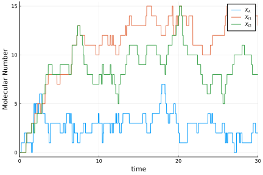

# A multi-next-delay example

## Model

The model is defined as follows: 1. $C:\emptyset \rightarrow X_A$; 2. $\gamma : X_A \rightarrow \emptyset $ ; 3. $\beta : X_A \rightarrow  X_{I1}+X_{I2}$, which triggers $X_{I1},X_{I2}\Rightarrow \emptyset$ after $\tau$ time; 4. $\gamma : X_{I1} \rightarrow \emptyset$; 5. $\gamma : X_{I2} \rightarrow \emptyset$. The 4th and 5th reactions will cause the delay channel to change its state during a schduled delay reaction. Note this example is to test multiple delay reactions. The exact solution can be found in [this example](@ref delay_degradation).
## Markovian part
We first define the parameters and the mass-action jump (see [Defining a Mass Action Jump](https://diffeq.sciml.ai/stable/types/jump_types/#Defining-a-Mass-Action-Jump) for details).

```julia
C, γ, β, τ = [2., 0.1, 0.5, 15.]
rate1 = [C,γ,β,γ,γ]
reactant_stoch = [[],[1=>1],[1=>1],[2=>1],[3=>1]]
net_stoch = [[1=>1],[1=>-1],[1=>-1,2=>1,3=>1],[2=>-1],[3=>-1]]
mass_jump = MassActionJump(rate1, reactant_stoch, net_stoch; scale_rates =false)
jumpset = JumpSet((),(),nothing,[mass_jump])
```
We can see the definition of the parameters in [this example](@ref Model_definition).

Then we initialise the problem by setting
```julia
u0 = [0, 0, 0]
tf = 30.
saveat = .1
de_chan0 = [[]]
tspan = (0.,tf)
```
So we can define the DiscreteProblem
```julia
dprob = DiscreteProblem(u0, tspan)
```
## Non-Markovian part

Then we turn to the definition of delay reactions

```julia
delay_trigger_affect! = function (integrator, rng)
   append!(integrator.de_chan[1], τ)
   append!(integrator.de_chan[2], τ)
end
delay_trigger = Dict(3=>delay_trigger_affect!)
delay_complete = Dict(1=>[2=>-1],2=>[3=>-1]) 

delay_affect1! = function (integrator, rng)
    i = rand(rng, 1:length(integrator.de_chan[1]))
    deleteat!(integrator.de_chan[1],i)
end
delay_affect2! = function (integrator, rng)
    i = rand(rng, 1:length(integrator.de_chan[2]))
    deleteat!(integrator.de_chan[2],i)
end
delay_interrupt = Dict(4=>delay_affect1!,5=>delay_affect2!) 
delayjumpset = DelayJumpSet(delay_trigger,delay_complete,delay_interrupt)
```

- `delay_trigger`  
  - Keys: Indices of reactions defined in `jumpset` that can trigger the delay reaction. Here we have the 3rd reaction $\beta : X_A \rightarrow  X_{I1}+X_{I2}$ that will trigger the $X_{I1}$ and $X_{I2}$ to degrade after time $\tau$.
  - Values: A update function that determines how to update the delay channel. In this example, once the delay reaction is trigged, the delay channel 1 (which is the channel for $X_{I1}$) and the delay channel 2 (which is the channel for $X_{I2}$ ) will be added a delay time $\tau$.					
- `delay_interrupt`
  - Keys: Indices of reactions defined in `jumpset` that can cause the change in delay channel. In this example, the 4th reaction $\gamma : X_{I1} \rightarrow \emptyset$ and the 5th reaction $\gamma : X_{I2} \rightarrow \emptyset$ will change the schduled delay reaction to change its state immediately.
  - Values: A update function that determines how to update the delay channel. In this example, once a delay-interrupt reaction happens, any of the reactants $X_{I1}$ and $X_{I2}$ that are supposed to leave the system after time $\tau$ can be degraded immediately.
- ```delay_complete:``` 
  - Keys: Indices of delay channel. Here the 1st delay channel corresponds to $X_{I1}$ and the 2 nd delay channel corresponds to $X_{I2}$ .
  - Values: A vector of `Pair`s, mapping species id to net change of stoichiometric coefficient.


where `de_chan0` is the initial condition for the delay channel, which is a vector of arrays whose `k`th entry stores the schduled delay time for `k`th delay channel. Here we assume $X_{I1}(0),X_{I2}(0)=0$, thus only two empty arrays. Next, we choose a delay SSA algorithm `DelayDirect()` and define the problem

```julia
djprob = DelayJumpProblem(dprob, DelayRejection(), jumpset, delayjumpset, de_chan0, save_positions=(true,true))
```
where `DelayJumpProblem` inputs `JumpProblem`, `DelayJumpSet` and the initial condition of the delay channel `de_chan0`.

## Visualisation
Now we can solve the problem and plot a trajectory
```julia
sol =@time solve(djprob, SSAStepper(),seed=10, saveat =.1, save_delay_channel = false)
```


Then we simulate $10^4$ trajectories and calculate the evolution of mean value for each reactant
```julia
using StatsBase
Sample_size = Int(1e4)
ens_prob = EnsembleProblem(djprob)
ens =@time solve(ens_prob,SSAStepper(),EnsembleThreads(),trajectories = Sample_size, saveat = .1, save_delay_channel =false)
```
### Verification with the exact solution
Lastly, we can compare with the mean values of the exact solutions $X_I,X_A$


