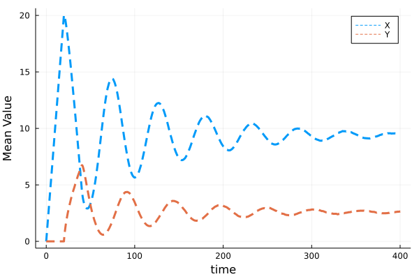

# A delay-induced oscillator
Let us study the following delay oscillatory network.
## Model definition

The model is defined as follows:
```math
\emptyset \xrightarrow{J_1(Y)} X\\
 Y\xrightarrow{J_2(Y)} \emptyset
```
and $\emptyset \xrightarrow{J_1(Y)} X$ will trigger $X\Rightarrow Y$ after $\tau$ time.

According to [Neural network aided approximation and parameter inference of non-Markovian models of gene expression](https://www.nature.com/articles/s41467-021-22919-1), it's an Illustration of a model of auto-regulation whereby a protein $X$ is transcribed by a gene, then it is transformed after a delay time $\tau$ into a mature protein $Y$, which binds the promoter and represses transcription of $X$. The function $J_1(Y)$ and $J_2(Y)$ can be defined as follows:
```math
J_1(Y)=k_1S\frac{K^p_d}{K^p_d+Y^p}\\J_2(Y)=k_2E_T\frac{Y}{K_m+Y}
```
In this example, we assume $k_1=k_2=S=E_T=K_d=P=K_m=1$ for convenience.

### Define a `JumpSet`

Since the rate varies with the number of molecules of $Y$, we should define `ConstantRateJump`

```julia
rate1 = (u,p,t) -> 1/(1+u[2]^2)
affect1! = function (integrator)
integrator.u[1] += 1
end
cons_jump1 = ConstantRateJump(rate1,affect1!)

rate2 = (u,p,t) -> u[2]/(1+u[2])
affect2! = function (integrator)
integrator.u[2] -= 1
end
cons_jump2 = ConstantRateJump(rate2,affect2!)
```

`rates` A function showing how the rate varies with the change of molecules of $Y$.

`affect!` is a function that shows the net change in the species when the reaction occurs.

Then we can define the `JumpSet`

```julia
jumpset = JumpSet((),(cons_jump1,cons_jump2),nothing,nothing)
```

### Define a `DiscreteProblem`

Then we initialise the problem by setting

```julia
u0 = [0,0]
de_chan0 = [[]]
tf = 400.
tspan = (0,tf)
τ = 20.
```

So we can define the `DiscreteProblem`

```julia
dprob = DiscreteProblem(u0, tspan)
```

The same as we did before, we must define the `DelayJumpSet`

```julia
delay_trigger_affect! = function (de_chan, rng)
    append!(de_chan[1], τ)
end
delay_trigger = Dict(1=>delay_trigger_affect!)
delay_complete = Dict(1=>[2=>1, 1=>-1])
delay_interrupt = Dict()
delayjumpset = DelayJumpSet(delay_trigger, delay_complete, delay_interrupt)
```

We can see how to define the  `DelayJumpSet` in [this example](https://palmtree2013.github.io/DelaySSAdocs.jl/dev/tutorials/bursty/).

So we can define the `DelayJumpProblem`

```julia
djprob = DelayJumpProblem(dprob, DelayRejection(), jumpset, delayjumpset, de_chan0, save_positions=(true,true))
```

where `DelayJumpProblem` inputs `DiscreteProblem`, `JumpSet`,`DelayJumpSet`, the algorithm we choose and the initial condition of the delay channel `de_chan0`.

## Solution and Visualisation

Now we can solve the problem and plot two trajectories of $X$ and $Y$.

```julia
sol_1 = solve(djprob, SSAStepper(), seed = 12345)
sol_2 = solve(djprob, SSAStepper(), seed = 1234)
```


Then we simulate $10^4$ trajectories and calculate the evolution of mean value for each reactant.

```julia
using StatsBase
Sample_size = Int(1e4)
ens_prob = EnsembleProblem(djprob)
ens =@time solve(ens_prob,SSAStepper(),EnsembleThreads(),trajectories = Sample_size, saveat = .1, save_delay_channel =false)
```



If we want to see how $Y$ varies when the number of $X$ changes, we will find something interesting.


## [Reference](https://palmtree2013.github.io/DelaySSAdocs.jl/dev/tutorials/delay_degradation/#Reference)

[1]Jiang, Q., Fu, X., Yan, S. *et al.* Neural network aided approximation and parameter inference of non-Markovian models of gene expression. *Nat Commun* **12,** 2618 (2021). https://doi.org/10.1038/s41467-021-22919-1
