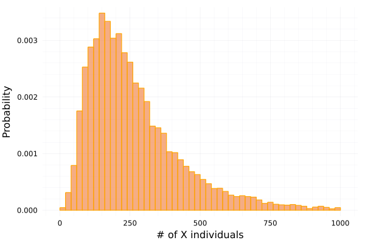

# A birth-death model with heterogeneous fixed delays

## Model definition
We study the following model with delayed production
```math
\emptyset \xrightarrow{A_n} X \text{ triggers } X \Rightarrow Y \text{ after $\tau$ time}\\
Y \xrightarrow{B_n} \emptyset
```
This model is studied in [1]. This delayed birth–death process can be used to model the dynamics of chemical species, such as proteins, that are produced through a sequence of reactions. We first consider fixed birth delays, $\tau_n$, which are constant across reactions within a cell, but may vary between cells. In the generative model above, the authors assume that, across the population, production rates, $A_n$, degradation rates, $B_n$, and the fixed birth delays, $\tau_n$, follow a gamma distribution. Decrease in protein count is due to growth-induced dilution or enzymatic degradation, and is described by an instantaneous death process with rate $B_n$.

### Markovian part
To define the Markovian part of the model, we set the model by
```julia
using Catalyst, DiffEqJump
using Distributions, Random
using DelaySSAToolkit
rn = @reaction_network begin
    A, 0 --> X
    B, Y --> 0
end A B
u0 = [0,0] # X, Y
tf = 100.
tspan = (0,tf)
ps = [10., 1.] # A, B. The initial conditions are dummy variables, later on will be drawn from Gamma distributions 
```
where $X$ is an extra species that represents the premature product in the delay channel that will turn into $Y$ after a delay time $\tau_n$ for each cell $n$. 
### Non-Markovian part

```julia
τ = 1 # dummy variable, later on will be drawn from a Gamma distribution 
delay_trigger = Dict(1=>[1=>τ])
delay_complete = Dict(1=>[1=>-1, 2=>1])
delay_interrupt = Dict()
jumpsys = convert(JumpSystem, rn, combinatoric_ratelaws=false)
dprob = DiscreteProblem(jumpsys,u0,tspan,ps)
de_chan0 = [[]]
delayjumpset = DelayJumpSet(delay_trigger, delay_complete, delay_interrupt)
jprob = DelayJumpProblem(jumpsys, dprob, DelayRejection(), delayjumpset, de_chan0, save_positions=(false,false))
```
Here the value of `delay_trigger` is `[1=>τ]`. This is of `Pair` type where the first index refers to the number of delay channel, the second index refers to the delay time. Such a definition is equivalent to appending a delay time $\tau$ to the first delay channel provided that the first reaction $A_n: 0\rightarrow X$ happened. `de_chan0` is the initial condition for delay channels, here we assume no on-going delay reactions.

## Heterogeneous fixed delays
### Define `EnsembleProblem` 
```julia
# the Gamma distribution in Julia uses shape α, scale θ, Gamma(α,θ). In the paper [1], Gamma distribution uses shape α and rate β. Thus, one needs to set the inverse.
function prob_func(prob, i ,repeat)
    rng = Random.seed!(i) # i is the index for each simulation
    A = rand(rng, Gamma(8,1/0.23)) 
    B = rand(rng, Gamma(9,1/625))
    τ = rand(rng, Gamma(7,1))
    remake(prob, p = [A,B], delay_trigger=Dict(1=>[1=>τ])) # update the new parameters
end
ensprob1 = EnsembleProblem(jprob, prob_func = prob_func)
@time ens1 = solve(ensprob1, SSAStepper(), EnsembleThreads(), trajectories = 40, saveat = 1.)
```
For each simulation $i$ (represents an individual cell), a set of parameters $A, B, τ$ will be drawn from Gamma distributions, where we use the parameters defined as in [1]. One only needs to reconstruct the `DelayJumpProblem` by assigning new values to the parameter `p=[A,B]` and `delay_trigger =  Dict(1=>[1=>τ])` for each simulation. This can be easily done by invoking the `remake` function.

## Visualisation
We can plot the time evolution of 40 simulations.


## Distributed delays
In [1, Section 3.2], the authors studied the case with distributed delays, where the delay can vary between reactions within and between cells. One can adopt the problem setting by changing few lines of code.
### Define `EnsembleProblem` 
```julia
function prob_func(prob, i ,repeat)
    rng = Random.seed!(i)
    α = rand(rng, Gamma(63,1/9))
    β = rand(rng, Gamma(10.,1/10.))
    A = rand(rng, Gamma(8,1/0.23))
    B = rand(rng, Gamma(9,1/625))
    τ = rand(rng, Gamma(α,1/β))
    remake(prob, p = [A,B], delay_trigger=Dict(1=>[1=>τ]))
end
ensprob2 = EnsembleProblem(jprob, prob_func = prob_func)
```
## Visualisation
Note that a simulation of $10^4$ samples with very high production number (upto ~1000 for X and ~3000 for Y) only takes few minutes on a laptop:
```julia-repl
julia> @time ens2 = solve(ensprob2, SSAStepper(), EnsembleThreads(), trajectories = 10^4)

 78.925908 seconds (249.65 M allocations: 28.632 GiB, 6.60% gc time)
EnsembleSolution Solution of length 10000 with uType
```
Here we plot the histogram of the number of unfinished reactant $X$s in the delay channel.



## Reference
[1] Mark Jayson Cortez, Hyukpyo Hong, Boseung Choi, Jae Kyoung Kim, Krešimir Josić, "Hierarchical Bayesian models of transcriptional and translational regulation processes with delays", Bioinformatics, 2021;, btab618, [https://doi.org/10.1093/bioinformatics/btab618](https://doi.org/10.1093/bioinformatics/btab618)