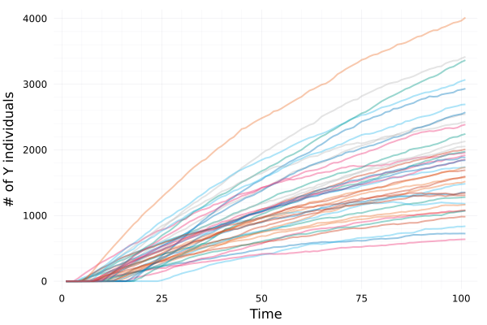

# A stochastic birth-death model with heterogeneous fixed delays

## Model definition
We study the following model with delayed production
```math
A_n: \emptyset \rightarrow X \text{ triggers } X \Rightarrow Y \text{ after $\tau$ time}\\
B_n: Y \rightarrow \emptyset
```
This model is studied in 

### Markovian part
```julia
using Catalyst, DiffEqJump
using Distributions, Random
using DelaySSAToolkit
rn = @reaction_network begin
    A, 0 --> X
    B, Y --> 0
end A B
u0 = [0,0]
de_chan0 = [[]]
tf = 100.
tspan = (0,tf)
ps = [10., 1.] # A, B. The initial conditions dummy variables, later on will be drawn from a Gamma distribution 
```

### Non-Markovian part

```julia
τ = 1 # dummy variable, later on will be drawn from a Gamma distribution 
delay_trigger = Dict(1=>[1=>τ])
delay_complete = Dict(1=>[1=>-1, 2=>1])
delay_interrupt = Dict()
jumpsys = convert(JumpSystem, rn, combinatoric_ratelaws=false)
dprob = DiscreteProblem(jumpsys,u0,tspan,ps)

delayjumpset = DelayJumpSet(delay_trigger, delay_complete, delay_interrupt)
jprob = DelayJumpProblem(jumpsys, dprob, DelayRejection(), delayjumpset, de_chan0, save_positions=(false,false))
```

## Heterogeneous fixed delays
### Define `EnsembleProblem` 
```julia
# the Gamma distribution in Julia uses shape α, scale θ, Gamma(α,θ). In the paper [1], Gamma distribution uses shape α and rate β. Thus, one needs to set the inverse.
function prob_func(prob, i ,repeat)
    rng = Random.seed!(i)
    A = rand(rng, Gamma(8,1/0.23)) 
    B = rand(rng, Gamma(9,1/625))
    τ = rand(rng, Gamma(7,1))
    remake(prob, p = [A,B], delay_trigger=Dict(1=>[1=>τ]))
end
ensprob1 = EnsembleProblem(jprob, prob_func = prob_func)
@time ens1 = solve(ensprob1, SSAStepper(), EnsembleThreads(), trajectories = 40, saveat = 1.)
```

## Visualisation


## Distributed delays
In [1, Section 3.2], the authors considerd the case with distributed delay, one can change the problem setting only by few lines of code.
### Define `EnsembleProblem` 
```julia
function prob_func(prob, i ,repeat)
    rng = Random.seed!(i)
    α = rand(rng, Gamma(63,1/9))
    β = rand(rng, Gamma(10.,1/10.))
    A = rand(rng, Gamma(8,1/0.23))
    B = rand(rng, Gamma(9,1/625))
    τ = rand(rng, Gamma(α,1/β))
    remake(prob, p = [A,B], delay_trigger=Dict(1=>[1=>τ]))
end
ensprob2 = EnsembleProblem(jprob, prob_func = prob_func)
```
## Visualisation
Note that a simulation of $10^4$ samples only takes few minutes on a laptop:
```julia-repl
julia> @time ens2 = solve(ensprob2, SSAStepper(), EnsembleThreads(), trajectories = 10^4)

 78.925908 seconds (249.65 M allocations: 28.632 GiB, 6.60% gc time)
EnsembleSolution Solution of length 10000 with uType
```
Here we plot the histogram of the number of unfinished reactant $X$s in the delay channel


